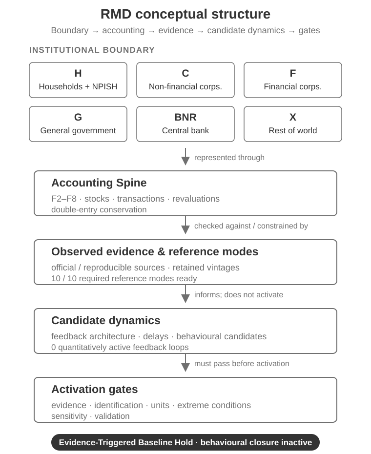

  

<h2 align="center">Romanian Monetary Dynamics (RMD)</h2>

  
  
  

<small><strong>An accounting-constrained research model of how financial stocks, transactions and financing relationships evolve across the Romanian economy.</strong></small>

<small>
<a href="#what-is-rmd">Overview</a> ·
<a href="#model-at-a-glance">Model structure</a> ·
<a href="#scientific-status-at-a-glance">Scientific status</a> ·
<a href="#reproduce-the-scientific-baseline">Reproduce</a> ·
<a href="#data-and-provenance">Data & provenance</a> ·
<a href="#documentation">Documentation</a>
</small>

---

### What is RMD?

Romanian Monetary Dynamics (RMD) is a scientific model core for studying Romania's monetary and macro-financial system through explicit balance-sheet, transaction and financing relationships.

The model is designed to keep **accounting structure** separate from **behavioural assumptions**. Stocks and flows must satisfy the declared stock-flow and double-entry constraints; behavioural responses, feedbacks and delays are admitted only when their evidence, identification and validation gates are satisfied.

Technically, RMD is an **accounting-constrained empirical stock-flow-consistent dynamic model** under development toward an endogenous System Dynamics reference model. Its current core contains SD-compatible stocks, flows, conservation rules, observed reference modes and a candidate feedback architecture, but **behavioural closure is inactive** and RMD is **not yet a complete endogenous System Dynamics model**.

RMD is intended for macro-financial research, stock-flow-consistent and System Dynamics modelling, reproducibility review, and development of the scientific model core. It is not an end-user forecasting application.

### Model at a glance

| Dimension | RMD boundary |
| --- | --- |
| Institutional sectors | Households + NPISH (H), non-financial corporations (C), financial corporations (F), general government (G), BNR, rest of world (X) |
| Financial instruments | ESA-style F2-F8: currency/deposits, debt securities, loans, equity/fund shares, insurance/pensions/guarantees, derivatives, other accounts |
| Accounting principle | Double-entry conservation and stock-flow consistency are hard constraints |
| Empirical targets | Monthly, quarterly and annual reference modes from official/reproducible sources |
| Dynamic structure | Candidate feedback architecture; quantitatively inactive unless activation gates pass |
| Canonical runtime | Python 3.12+ |
| Current scientific state | **Evidence-Triggered Baseline Hold** |

The full sector-by-instrument accounting system is deliberately not reproduced as a large diagram on this page. The canonical sector and instrument registries are in [model/registries/sectors.json](model/registries/sectors.json) and [model/registries/instruments.json](model/registries/instruments.json).

  <picture>
    <source media="(prefers-color-scheme: dark)" srcset="assets/readme/rmd-concept-overview-dark.svg">
    <source media="(prefers-color-scheme: light)" srcset="assets/readme/rmd-concept-overview-light.svg">
    
  </picture>

The figure is intentionally **not** a causal-loop diagram and **not** the complete 6×6×7 accounting matrix. It is a first-page orientation view. Exact bilateral coverage, feedback paths and activation status remain governed by the canonical registries.

### How RMD is structured

| Layer | Role | Current boundary |
| --- | --- | --- |
| **Accounting Spine** | Defines sector/instrument positions, transactions and conservation identities | Hard constraint; canonical multi-instrument completion remains partial |
| **Observed evidence & reference modes** | Supplies behaviour-over-time targets and official empirical evidence | 9 of 10 required reference modes are ready |
| **Candidate dynamics** | Defines possible behavioural responses, delays and feedback paths | Candidate architecture only; no quantitative feedback activation |
| **Validation & activation gates** | Determines whether a mechanism may enter calibration, validation or the integrated reference model | No active calibration/refit cycle; behavioural closure inactive |

This separation is central to RMD. An empirical mechanism being listed or tested does **not** automatically activate a System Dynamics feedback loop, and a partial accounting recovery does **not** count as a complete canonical instrument.

### Scientific status at a glance

| Scientific dimension | Current state |
| --- | --- |
| Accounting / stock-flow core | **Partial pass** |
| Canonically complete stock + flow instruments | **F3 only** |
| Required reference modes | **9 / 10 ready** |
| Validated reference behavioural mechanisms | **0** |
| Quantitatively active feedback loops | **0** |
| Behavioural closure | **Inactive** |
| Calibration / refit cycle | **Closed** |
| Operational state | **Evidence-Triggered Baseline Hold** |

The remaining reference-mode blocker is sectoral_financial_positions. Current public-source recovery is frozen until a declared new-source or changed-dataset trigger is satisfied.

For the exact current scientific boundary, including evidence gates and reopen conditions, see [STATUS.md](STATUS.md).

### Candidate dynamic structure

RMD currently retains four topologically closed candidate feedback loops and one open candidate chain. **None is quantitatively active.**

| Candidate structure | Topology | Current scientific state |
| --- | --- | --- |
| Government refinancing–interest | Closed candidate loop | Behavioural candidate; inactive |
| Government issuance–yield | Closed candidate loop | Behavioural candidate; inactive |
| Bank credit–balance-sheet | Closed candidate loop | Behavioural candidate; inactive |
| Monetary–credit transmission | Closed candidate loop | Behavioural candidate; inactive |
| External FX–refinancing | Open chain | Not a closed feedback loop; inactive |

The exact paths, link signs, delay candidates and activation requirements are in [model/dynamics/feedback_registry.json](model/dynamics/feedback_registry.json).

### What RMD establishes — and what it does not

**RMD currently provides:**

- an explicit institutional-sector and financial-instrument accounting boundary;
- machine-checkable accounting, dimensional and System Dynamics conformity gates;
- retained official/reproducible source vintages and provenance;
- nine observed reference modes ready for the current quantitative closure gate;
- preregistered empirical selection/validation artifacts for tested mechanisms;
- reproducible scientific-baseline verification through CI and local audit scripts.

**RMD does not currently claim:**

- a complete endogenous System Dynamics model;
- validated behavioural closure;
- a validated policy-forecasting or policy-simulation engine;
- a validated reference behavioural mechanism;
- automatic causal interpretation of candidate relations;
- that missing or unresolved values are zero;
- that aggregate or partial evidence can be used as invented bilateral allocations.

### Reproduce the scientific baseline

RMD requires **Python 3.12 or newer**.

A local verification path corresponding to the core of Scientific CI is:

~~~bash
git clone https://github.com/LaurentiuStaicu/romanian-monetary-dynamics.git
cd romanian-monetary-dynamics

python3.12 -m venv .venv
source .venv/bin/activate

python -m pip install --upgrade pip build
python -m build
python -m pip install --no-deps dist/*.whl

python -m unittest discover -s tests -v
python scripts/audit_accounting_readiness.py
python scripts/audit_dimensional_consistency.py
python scripts/audit_system_dynamics_conformity.py
python scripts/audit_scientific_baseline_manifest.py
python scripts/verify_validation_recovery_provenance.py
~~~

A successful run verifies the repository's declared accounting invariants, dimensional consistency, System Dynamics conformity boundary, cross-registry scientific state and retained provenance. It **does not** mean that the model has acquired behavioural closure, causal identification or policy-forecast validation.

The canonical CI workflow is [.github/workflows/scientific-ci.yml](.github/workflows/scientific-ci.yml).

### Data and provenance

RMD treats source provenance as part of the scientific model, not as auxiliary housekeeping.

~~~text
official / reproducible source
            ↓
retained source vintage
            ↓
processed series or accounting artifact
            ↓
evidence / measurement contract
            ↓
selection, validation or readiness gate
~~~

Core data-integrity rules include:

- **missing / TBD is not zero;**
- **partial or component evidence is not canonical completion;**
- **aggregate evidence is not a bilateral allocation;**
- **provider or access failure is not negative scientific evidence;**
- **missing bilateral positions are never invented merely to close a matrix.**

Retained historical source material is under [data/source_vintages/](data/source_vintages/); processed scientific series are under [data/processed/](data/processed/); provenance contracts and retained evidence are linked from the model registries.

### Repository map

| Path | Purpose |
| --- | --- |
| [model/accounting/](model/accounting/) | Accounting Spine, instrument coverage, rank/materialisation and reconciliation gates |
| [model/dynamics/](model/dynamics/) | Dynamic core, reference modes, candidate feedbacks, units and SD conformity |
| [model/empirical_dynamics/](model/empirical_dynamics/) | Behavioural mechanism/evidence contracts and canonical mechanism registry |
| [model/calibration_validation/](model/calibration_validation/) | Measurement, selection, holdout, source-readiness and validation artifacts |
| [model/registries/](model/registries/) | Canonical cross-cutting model, scientific-stage and release-governance state |
| [data/source_vintages/](data/source_vintages/) | Retained source evidence used for reproducibility |
| [data/processed/](data/processed/) | Model-ready processed empirical series |
| [scripts/](scripts/) | Reproduction, audit, materialisation and validation scripts |
| [tests/](tests/) | Scientific invariant and regression tests |
| [releases/](releases/) | Frozen release notes and versioning policy |

### Where should I start?

| If you want to… | Start here |
| --- | --- |
| Understand what RMD represents | This README → **Model at a glance** |
| See the exact current scientific state | [STATUS.md](STATUS.md) |
| Inspect accounting sectors and instruments | [model/registries/](model/registries/) and [model/accounting/](model/accounting/) |
| Inspect candidate dynamics and SD boundary | [model/dynamics/](model/dynamics/) |
| Reproduce the baseline | **Reproduce the scientific baseline** above and [.github/workflows/scientific-ci.yml](.github/workflows/scientific-ci.yml) |
| Inspect source provenance | [data/source_vintages/](data/source_vintages/) and provenance-linked model contracts |
| See release history | [CHANGELOG.md](CHANGELOG.md) and [releases/](releases/) |
| Cite the model | [CITATION.cff](CITATION.cff) |

### Release state

The latest public scientific-core release is **v0.1.0**. The main branch contains unreleased scientific-integrity, reproducibility and governance work. The next substantive public release candidate is **v0.2.0**, but development activity does not itself authorize a release or version bump.

Version changes are governed atomically by [releases/README.md](releases/README.md) and [model/registries/release_versioning_contract.json](model/registries/release_versioning_contract.json).

### Documentation

- [STATUS.md](STATUS.md) — exact current scientific boundary and stage history.
- [model/registries/model_contract.json](model/registries/model_contract.json) — canonical model and repository-governance contract.
- [model/registries/scientific_baseline_manifest.json](model/registries/scientific_baseline_manifest.json) — cross-registry scientific maturity snapshot.
- [model/dynamics/system_dynamics_conformity_gate.json](model/dynamics/system_dynamics_conformity_gate.json) — System Dynamics / Systems Thinking conformity rules.
- [model/accounting/accounting_readiness_gate.json](model/accounting/accounting_readiness_gate.json) — canonical Accounting Spine readiness.
- [CHANGELOG.md](CHANGELOG.md) — released and unreleased changes.
- [releases/](releases/) — release policy and frozen release notes.
- [CITATION.cff](CITATION.cff) — citation metadata.

### Support, citation and license

For reproducible bugs, documentation problems or questions about repository behaviour, open a GitHub issue and include the RMD version or commit, Python version, command executed and relevant traceback/output. Scientific claims should be discussed against the canonical contracts and retained evidence rather than inferred from README prose alone.

If you use RMD in research, cite the exact released version using [CITATION.cff](CITATION.cff).

RMD is released under the [MIT License](LICENSE). Third-party datasets and source documents retain their own licensing and reuse terms.
